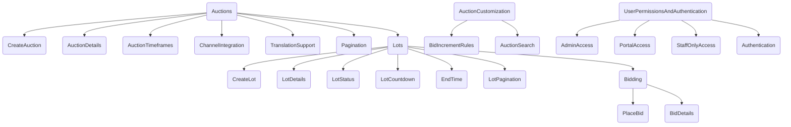

# Saleor Plugin Extension Documentation

## Overview

This documentation provides an in-depth explanation of the Saleor Plugin Extension, highlighting its features and how it integrates seamlessly with Saleor. This extension is designed to enhance the functionality of Saleor by introducing auctions and lots into the platform. It leverages Saleor's existing user management, channel permissions, and authentication mechanisms to provide a comprehensive solution for online auctions.

## Features

### 1. Auction Management

The Saleor Plugin Extension introduces the concept of auctions into the Saleor platform. Users can create, manage, and participate in auctions seamlessly. Here's how it works:

* **Creating Auctions:** Users with the appropriate permissions can create auctions using the `createAuction` mutation. They can specify details such as the auction name, description, start time, end time, and more.
    
* **Auction Details:** Auctions are represented as a separate data type with fields such as `id`, `name`, `slug`, `description`, `seoDescription`, `seoTitle`, `backgroundImage`, and `backgroundImageAlt`. These fields allow for detailed auction management.
    
* **Auction Timeframes:** Auctions have precise start and end times (`startsOn` and `endsOn` fields) to ensure that bidding occurs within specified windows.
    
* **Channel Integration:** Auctions are associated with channels, allowing for multichannel support within Saleor.
    
* **Translation Support:** Auctions can be translated into different languages, catering to a diverse user base.
    
* **Pagination:** Users can retrieve paginated lists of auctions using the `auctions` query, which supports pagination parameters like `first`, `after`, `last`, and `before`.
    

### 2. Lot Management

Within each auction, users can create and manage individual lots. Lots represent individual items or products available for bidding within an auction. Here's how lot management works:

* **Creating Lots:** Users can create lots within auctions using the `createLot` mutation. They provide details such as the lot name, description, base price, and more.
    
* **Lot Details:** Lots are represented as a separate data type with fields such as `id`, `name`, `description`, `currentBid`, `basePrice`, `auction`, `lotStatus`, and more. These fields provide comprehensive information about each lot.
    
* **Lot Status:** Each lot has a status (`lotStatus`) indicating whether it is open for bidding, closed, or sold.
    
* **Lot Countdown:** The `countdown` field specifies the time remaining for bidding on a lot. This countdown ensures a sense of urgency and competitiveness among users.
    
* **End Time:** The `endDateTime` field indicates the precise end time for bidding on a lot. This ensures that all bids are placed within the specified timeframe.
    
* **Lot Pagination:** Users can retrieve paginated lists of lots using the `lots` query, which supports pagination parameters similar to auctions.
    

### 3. Bidding and Bid Management

Users can place bids on lots within auctions, and the system tracks bid history. Here's how bidding works:

* **Placing Bids:** Users can place bids on open lots using the `placeBid` mutation. They provide the lot ID and bid amount.
    
* **Bid Details:** Bids are represented as a separate data type with fields such as `id`, `user`, `amount`, `timestamp`, and `product`. These fields provide a detailed history of bids, including the user who placed the bid, the amount, and the timestamp.
    

### 4. Auction Customization

Saleor Plugin Extension allows for customization and configuration of auctions:

* **Bid Increment Rules:** Users can define bid increment rules using the `createBidIncrementRule` mutation. These rules specify how bid amounts should increase during auctions.
    
* **Auction Search:** Users can search for auctions based on keywords using the `searchAuctions` query. This feature simplifies the process of finding specific auctions within the platform.
    

### 5. User Permissions and Authentication

The Saleor Plugin Extension seamlessly integrates with Saleor's user management, channel permissions, and authentication mechanisms:

* **Admin Access:** The `@adminAccess` directive is used to restrict access to specific operations to users with admin privileges. This ensures that critical functions are performed only by authorized personnel.
    
* **Portal Access:** The `@portalAccess` directive limits access to certain features or data to users who have portal access. This ensures that sensitive information is protected and accessible only to authorized users.
    
* **Staff-Only Access:** The `@staffOnly` directive restricts access to operations to staff users. This helps in managing and delegating responsibilities within the organization effectively.
    
* **Authentication:** Users can register the app using the `register` mutation, providing authentication tokens and domain information. This ensures a secure connection between the Saleor Plugin Extension and Saleor.
    

## Conclusion

The Saleor Plugin Extension enhances the Saleor platform by introducing powerful auction and lot management features. Leveraging Saleor's existing user management, channel permissions, and authentication mechanisms, this extension provides a seamless and secure solution for conducting online auctions. Users can create, manage, and participate in auctions with confidence, benefiting from detailed auction and lot information, bid history, and user-friendly interfaces.
* * *

